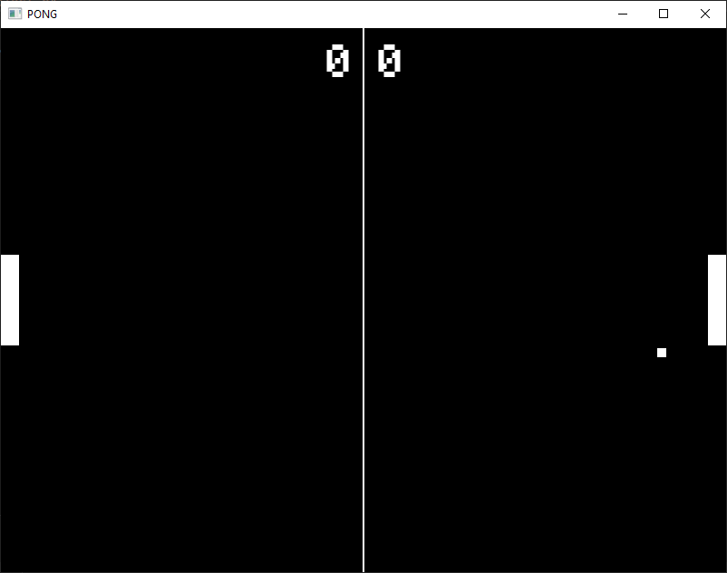
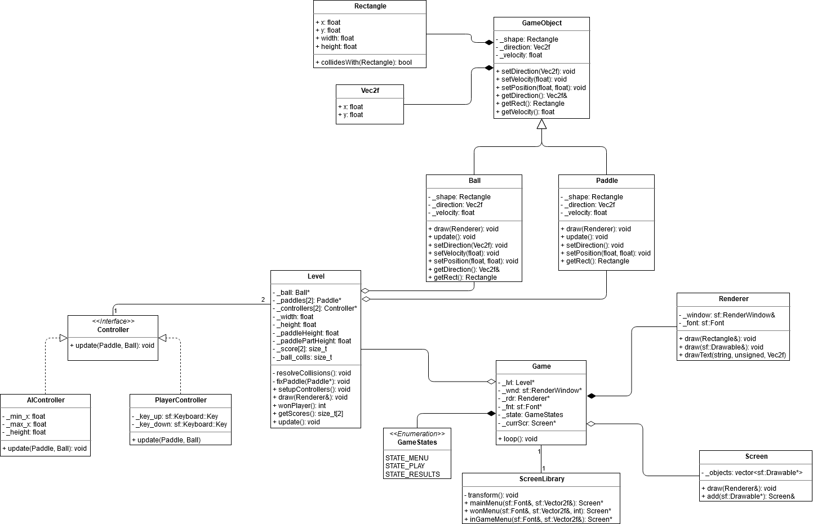

## Pong
Классический симулятор настольного тенниса

## Управление
На экране выбора режима:
- 1 - выбрать режим игры против ИИ
- 2 - выбрать режим игры против второго игрока

В самой игре
- правая ракетка - стрелки вверх и вниз
- левая ракетка (при игре со вторым игроком) - W/S

## UML диаграмма разработанных классов
